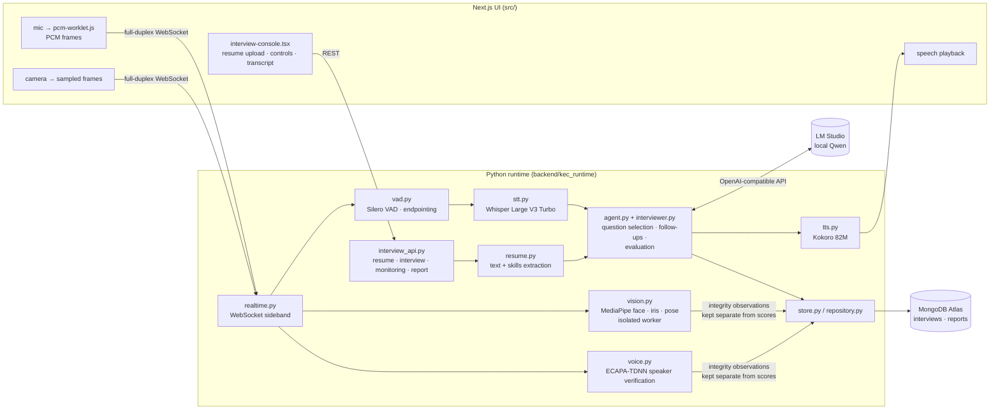

# KEC Local Interviewer

A resume-aware autonomous mock interviewer for Apple Silicon. Next.js is only the browser UI; Python 3.11.9 owns orchestration, local AI inference, monitoring, scoring, and persistence.

## Runtime split

- `src/`: Next.js UI, microphone/camera device access, playback, and rendering only.
- `backend/kec_runtime/agent.py`: autonomous question selection and evaluation.
- `backend/kec_runtime/interview_api.py`: resume, interview, monitoring, and report API.
- `backend/kec_runtime/vision.py`: isolated MediaPipe face, iris, and pose worker.
- `backend/kec_runtime/stt.py`: local Whisper Large V3 Turbo transcription.
- `backend/kec_runtime/vad.py`: streaming Silero VAD and endpoint control.
- `backend/kec_runtime/realtime.py`: full-duplex WebSocket interview sideband.
- `backend/kec_runtime/voice.py`: ECAPA-TDNN candidate speaker verification.
- MongoDB Atlas: interview and report persistence.
- LM Studio: local Qwen interviewer and evaluator.

The browser only captures device media. Python analyzes audio and sampled camera frames. Integrity observations are stored separately from technical scores: gaze, posture, appearance, and accent never lower answer-quality scores.

## Architecture



## Prerequisites

- Bun 1.3+
- Python exactly 3.11.9 (the repository includes `.python-version`)
- `uv` is recommended for Python environment management

## Setup

```bash
bun install
uv sync --extra dev
cp .env.example .env.local
```

Run the Python backend:

```bash
uv run --offline uvicorn kec_runtime.main:app --app-dir backend --host 127.0.0.1 --port 8765 --reload
```

In another terminal, run the UI:

```bash
bun dev
```

Open `http://localhost:3000`, upload a PDF/DOCX/TXT resume, select a role, and allow camera/microphone access.

## Connect LM Studio

Create a backend `.env` file:

```dotenv
KEC_LM_STUDIO_BASE_URL=http://127.0.0.1:1234/v1
KEC_LM_STUDIO_MODEL=qwen3.5-4b-mlx
KEC_MOCK_MODE=false
KEC_MONGODB_URI=your-mongodb-connection-string
KEC_MONGODB_DATABASE=kec_interviewer
```

LM Studio remains local. Real inference is the default; mock mode must be enabled explicitly. If
LM Studio is unavailable, the setup screen and API expose the error instead of silently repeating
a fallback question. Keep `.env` private and rotate any database credential that has been shared
in chat.

## Local model assets

The runtime uses:

- `qwen3.5-4b-mlx` through LM Studio at port `1234`.
- `mlx-community/whisper-large-v3-turbo`, cached under `data/models/huggingface`.
- `speechbrain/spkrec-ecapa-voxceleb`, cached under `data/models/speaker`.
- Kokoro 82M with the US English `af_heart` voice, cached under `data/models/kokoro`.
- MediaPipe Face Landmarker and Pose Landmarker Lite task files under `data/models`.

The browser sends 16 kHz PCM and JPEG samples through a persistent WebSocket. Silero VAD automatically starts and ends turns; Whisper only receives completed speech segments. The vision worker runs in a separate process because native MediaPipe failures must never terminate the interview API. Multiple-person and voice signals require persistence before creating a review flag.

Normal server starts are offline and use the cached model snapshots only. To allow a one-time
model download during setup, set `KEC_ALLOW_MODEL_DOWNLOADS=true`; turn it off again afterwards.

Install the Kokoro voice assets once before the first interview:

```bash
KEC_ALLOW_MODEL_DOWNLOADS=true uv run python -c 'from kec_runtime.config import Settings; from kec_runtime.tts import KokoroTts; KokoroTts(Settings())._ensure_assets()'
```

## Checks

```bash
bun run check
bun run build
uv run pytest
uv run ruff check backend
uv run mypy backend/kec_runtime
```

## Interview flow

1. Resume text and skills are extracted locally.
2. The interview always begins with a natural, role-focused self-introduction. Qwen then uses the
   actual resume, target role, and level to choose the technical and behavioral questions.
3. The microphone stream pauses while browser speech synthesis is playing. A short post-playback
   guard discards residual speaker echo before listening begins.
4. Silero requires stable speech onset before opening a candidate turn, while browser acoustic
   echo cancellation and server-side spectral cleanup reduce noise. The live `Voice pickup`
   slider (or `KEC_VAD_SENSITIVITY=0.0..1.0`) tunes the energy threshold.
5. After every answer, the agent sees the relevant resume text, role expectations, and recent
   conversation. It decides whether a natural follow-up or a new role-relevant area will reveal
   more. Garbled speech gets one clarification; a clear knowledge gap is recorded and the agent
   moves to a different competency instead of repeatedly testing the same concept.
6. MediaPipe aggregates face presence, broad gaze zone, posture, and multiple-person signals.
7. ECAPA-TDNN speaker embeddings create conservative, review-only multi-voice observations.
8. Qwen produces competency scores, evidence, improvements, and a seven-day plan.
9. The interview and report are stored in MongoDB collections named `interviews` and `reports`.
